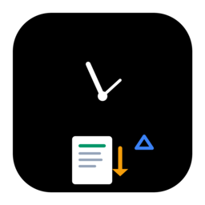

<p align="center">
  
</p>

<h1 align="center">◆ LeadTime</h1>
<p align="center"><strong>Lead Time Management System</strong><br>PT Eco Paper Indonesia</p>

<p align="center">
  
  
  
  
  <br>
  
  
  
  
</p>

---

## 🚀 Quick Start

```bash
git clone https://github.com/andrizpray/Lead-time-app.git
cd Lead-time-app
python3 -m venv venv && source venv/bin/activate
pip install -r requirements.txt
python src/main.py
```

**One-click build:**
```bash
bash build.sh          # Incremental
bash build.sh --clean  # Fresh build
```

---

## 🎯 Apa Itu LeadTime?

Aplikasi desktop untuk **tracking, analisis, dan pelaporan** waktu lead time loading DO. Dirancang khusus untuk operasional pabrik kertas — pantau berapa lama setiap truk loading, berapa tonase per shift, dan siapa customer terbesar — semua dalam satu dashboard.

---

## ✨ Fitur Utama

<table>
<tr>
<td width="50%">

### 📥 Input & Import
- **Form input manual** — validasi real-time, auto-kalkulasi
- **Import Excel wizard** — 3 langkah, preview warna, error summary
- **Auto-detect header** — scan 15 baris, handle berbagai format
- **Dynamic spinbox** — adjust otomatis hingga 999.999 kg

### 📊 Tabel Data
- 16 kolom lengkap + filter + search
- Pagination 50/100/200 per halaman
- Highlight duplikat kuning
- Double-click edit, toolbar CRUD

### 📈 Dashboard
- 3 summary cards (Total DO, Tonase, Lead Time)
- Bar chart lead time + Pie shift + Line dual-axis tonase
- Top 10 customer table
- Date range presets (7/30/90 hari)

</td>
<td width="50%">

### 📋 Laporan
- **6 jenis**: Grafik Harian, Harian, Mingguan, Bulanan, Customer, Ekspedisi
- **Grafik Harian**: 3 chart + tabel detail per DO
- Export Excel + PDF dengan timestamp

### ⚙️ Pengaturan
- Profil perusahaan
- **Jadwal shift per tanggal** — support overnight, re-kalkulasi 1 klik
- Backup/restore database

### 🔒 Production Ready
- Logging bulanan + crash handler
- SQLite WAL mode — fast & durable
- `close_db()` — safe exit & crash
- 36 automated tests — all passing

</td>
</tr>
</table>

---

## 🏗️ Tech Stack

| Layer | Tech |
|:------|:-----|
| **UI** | `PySide6` — Qt6 for Python |
| **Charts** | `PySide6.QtCharts` — native Qt Charts |
| **ORM** | `Peewee 3.x` |
| **Database** | `SQLite` — WAL mode, single-file |
| **Excel** | `openpyxl` + `pandas` |
| **PDF** | `ReportLab 4.x` |
| **Build** | `PyInstaller 6.x` — single .exe |
| **Theme** | Swiss Modernism — `#F5F7FA` + `#059669` |

---

## 📁 Struktur

```
LeadTimeAppPython/
├── src/
│   ├── main.py                   ← Entry point + logging + crash handler
│   ├── core/
│   │   ├── database.py           ← SQLite WAL init + error handling
│   │   ├── models.py             ← DORecord (17 fields) + auto-calc logic
│   │   ├── report.py             ← 6 report generators
│   │   ├── settings.py           ← JSON config + backup/restore
│   │   └── migration.py          ← Schema versioning
│   ├── ui/
│   │   ├── main_window.py        ← Sidebar navigasi + 6 halaman
│   │   ├── dashboard.py          ← 4 chart + 3 card + customer table
│   │   ├── do_table.py           ← Tabel + filter + pagination
│   │   ├── do_form.py            ← Form input/edit + validasi
│   │   ├── import_wizard.py      ← Wizard import Excel + overlay
│   │   ├── report_widget.py      ← Grafik Harian + 5 laporan + export
│   │   ├── settings_widget.py    ← Shift schedule table + backup
│   │   └── loading_overlay.py    ← Overlay animasi
│   └── utils/
│       ├── excel_handler.py      ← Parser Excel + auto-detect
│       ├── excel_exporter.py     ← Export report ke .xlsx
│       └── pdf_generator.py      ← Export report ke .pdf
├── assets/                       ← Icon SVG/PNG/ICO
├── data/leadtime.db              ← Database (auto-created)
├── build.sh                      ← One-click build
├── leadtime.spec                 ← PyInstaller config
└── requirements.txt
```

---

## 🗄️ Model DORecord

| Field | Type | Keterangan |
|:------|:-----|:-----------|
| `tgl` | Date | Tanggal DO |
| `no_shipment` | String(50) | Nomor shipment — **unique key** dengan `tgl` |
| `no_do` | String(50) | Nomor DO |
| `customer` | String(100) | Nama customer |
| `kota_kab` | String(100) | Kota/Kabupaten |
| `jenis` | String(50) | ROLL / SHEET |
| `ekspedisi` | String(100) | Nama ekspedisi |
| `jenis_truk` | String(50) | Tipe truk |
| `loading_mulai` | Time | Jam mulai loading |
| `loading_selesai` | Time | Jam selesai loading |
| `lead_time_menit` | Integer | **Auto-calc** — selisih menit |
| `tonase_roll` | Float | Tonase ROLL (kg) |
| `tonase_sheet` | Float | Tonase SHEET (kg) |
| `tonase_total` | Float | **Auto-calc** — roll + sheet |
| `shift` | Integer | **Auto-detect** — date-aware schedule |
| `created_at` | DateTime | Timestamp |

---

## 🔧 Pengembangan

```bash
# Test semua fitur (36 test)
python3 /tmp/test_all_features.py

# Code style
# - Type hints wajib
# - Docstrings Bahasa Indonesia
# - snake_case untuk fungsi, PascalCase untuk class
```

---

## 📄 Lisensi

Proyek internal **PT Eco Paper Indonesia**. © 2026

---

<p align="center">
  <sub>◆ Dibangun dengan Python + PySide6 + SQLite ◆</sub>
</p>
